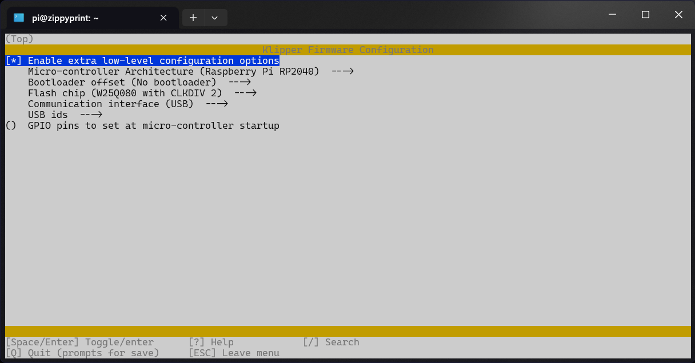

<!--
 Copyright (C) 2022 Chris Laprade
 
 This file is part of zippy_config.
 
 zippy_config is free software: you can redistribute it and/or modify
 it under the terms of the GNU General Public License as published by
 the Free Software Foundation, either version 3 of the License, or
 (at your option) any later version.
 
 zippy_config is distributed in the hope that it will be useful,
 but WITHOUT ANY WARRANTY; without even the implied warranty of
 MERCHANTABILITY or FITNESS FOR A PARTICULAR PURPOSE.  See the
 GNU General Public License for more details.
 
 You should have received a copy of the GNU General Public License
 along with zippy_config.  If not, see <http://www.gnu.org/licenses/>.
-->

# Contents

- [Contents](#contents)
- [Flashing a Pico for USB](#flashing-a-pico-for-usb)
  - [Compiling the firmware](#compiling-the-firmware)
  - [Flashing the firmware](#flashing-the-firmware)
  - [Retrieving the ID](#retrieving-the-id)
  - [Configuring Klipper](#configuring-klipper)
  - [Adding an accelerometer](#adding-an-accelerometer)
  - [Useful Extras](#useful-extras)
    - [MCU Core Temperature](#mcu-core-temperature)
      - [Configure MCU Core Temperature](#configure-mcu-core-temperature)
      - [Using MCU Core Temperature](#using-mcu-core-temperature)
    - [Neopixel LED](#neopixel-led)
      - [Configure Neopixel LED](#configure-neopixel-led)
      - [Control Neopixel LED](#control-neopixel-led)
      - [Configure Neopixel Enable Pin](#configure-neopixel-enable-pin)
    - [Static LED](#static-led)
      - [Configure Static LED](#configure-static-led)
      - [Control Static LED](#control-static-led)
    - [Organizing your config](#organizing-your-config)
    - [Useful Links](#useful-links)

# Flashing a Pico for USB

This guide will walk you through compiling and flashing Klipper firmware on a USB Pico board. This process will work for any RP2040-based boards.

However, some steps such as putting the board into flashing mode may differ slightly between models.

## Compiling the firmware

Run the following:

    cd ~/klipper
    make menuconfig

Use this configuration for a usb-connected Pico board:

Match those settings, and then press `q`

Press `y` to save changes.

Now run:

    make

This will take a moment, and once complete it will spit out a `klipper.u2f` file in `~/klipper/out`

Now we need to put the board into flashing mode.

This is typically performed by holding the boot button while connecting the board to USB.

## Flashing the firmware

You can now try to run the following command:

    sudo mount /dev/sda1 /mnt

If putting the Pico into flash-mode was unsuccessful, it won't show up as a mountable storage device.

If you have other external storage devices the `sda1` part may be different.

You can use the following command to see all the available storage devices:

    sudo fdisk -l

Match your Pico with the correct `/dev/sda#` address and modify the `mount` command as necessary.

When you have successfully mounted the storage there will be no feedback or errors from the mount command.

You can test it by running:

    ls /mnt

The storage should contain a couple of files:

1. INDEX.HTM
2. INFO_UF2.TXT

If the `ls` command returns those, you are ready to flash!

Run the following command:

    sudo cp out/klipper.uf2 /mnt

This will copy the firmware image we compiled earlier onto the Pico's storage and it will be flashed automatically.

This may take a minute or so.

When it is complete, the storage will be automatically unmounted.

I like to repeatedly run the `ls /mnt` command until it stops listing the files. That indicates the flash is now complete.

## Retrieving the ID

You can now run the `ls /dev/serial/by-id/*` command and if the flash was successful it should list a serial ID for the Pico.

An RP2040 ID will look something like this:

    usb-Klipper_rp2040_E660C063145C6B24-if00

A properly flashed Klipper firmware will have `Klipper_rp2040` in the ID.

If no ID is shown, try disconnecting the Pico from USB and reconnecting it before running the command again.

If it still fails to list an ID, then you may have missed a step and should go back and repeat all of the previous steps until the flash is successful.

## Configuring Klipper

Once you have successfully compiled and flashed the firmware and retrieved the serial ID, we are now ready to configure Klipper.

This is the easy part.

In your `printer.cfg` file, add the following:

    [mcu my_pico]
    serial: /dev/serial/by-id/usb-Klipper_rp2040_E660C062135C6A24-if00

Remember to change the `usb-Klipper_rp2040_E660C063145C6B24-if00` to your board's unique ID.

You can name it however you'd like. 

In this example we will use `my_pico` but any name is acceptable. 

Just remember to use that same name when referencing the mcu/pins in [other configuration sections](#mcu-core-temperature).

That's it!

Presumably you'd like to add additional components, but I would suggest starting out with just this most basic pico mcu configuration to ensure Klipper is able to connect successfully.

If you are able to successfully start/connect Klipper with that section added to your `printer.cfg` file, you are done!

You can now try adding some extras as described below:

## Adding an accelerometer

You can wire up an accelerometer like an [ADXL345](https://www.klipper3d.org/Config_Reference.html#adxl345) to a Pico for use in Klipper.

Here is an example:

    [adxl345 my_accel]
    cs_pin: my_pico: gpio1
    spi_software_sclk_pin: my_pico: gpio2
    spi_software_mosi_pin: my_pico: gpio3
    spi_software_miso_pin: my_pico: gpio4

Then you just wire up the corresponding pins on the accelerometer to the gpio pins. The pins you use may be different depending on the model of Pico you have.

I try to use the existing SPI bus, but as shown in the example above, you can just specify the pins you want to use and it doesn't matter what their original purpose was.

If you only have the one accelerometer, you do not need to name it. You can just use:

    [adxl345]

instead of:

    [adxl345 my_accel]

You will then need to add a [resonance_tester](https://www.klipper3d.org/Config_Reference.html#resonance_tester) section.

If you have multiple accelerometers that will look something like this:

    [resonance_tester]
    accel_chip_x: adxl345 my_other_accel
    accel_chip_y: adxl345 my_accel
    probe_points:
        100,100,20 # an example

If you have only a single accelerometer, it will look more like this:

    [resonance_tester]
    accel_chip: adxl345
    probe_points:
        100,100,20 # an example

The `probe_points` value is the X,Y,Z coordinates where you would like the test to occur. You can also test in multiple locations by adding additional coordinates on a new line below. For example:

    probe_points:
        100,100,20 # an example
        50,50,100  # another example

[This is a fantastic resource if you want more information on setting up an accelerometer.](https://klipper.discourse.group/t/raspberry-pi-pico-adxl345-portable-resonance-measurement/1757)
## Useful Extras

### MCU Core Temperature

#### Configure MCU Core Temperature

We can have Klipper read the core temperature from the Pico to monitor it.

This is a built-in sensor that is present on all RP2040 chips.

To do that, simply add the following to your `printer.cfg` file:

    [temperature_sensor pico_temp]
    sensor_type: temperature_mcu
    sensor_mcu: my_pico
    min_temp: 0
    max_temp: 100

Note that we are using `my_pico` for the `sensor_mcu`

As with the mcu itself, we can name the temperature sensor however we'd like.

Some helpful guidelines:

`pico_temp` will typically display as `Pico Temp` in most interfaces (Mainsail, Fluidd, KlipperScreen, etc)

`_pico_temp` will be hidden from the user interface in Mainsail and KlipperScreen (but not Fluidd) 

Putting an underscore at the start of the name can be used to create components that are controllable/readable from macros, but not from the UI. This works with macros, fans, sensors, heaters, output_pins, etc.

#### Using MCU Core Temperature

We can reference the current core temperature in macros using the following method:

First we create a shortcut allowing us to use `core_temp` to reference the value in our macro:

    

Then we can use that as follows:

    M117 "Pico: {core_temp}"

or:

    
        M117 Too hot!!!
    

[Klipper Docs](https://www.klipper3d.org/Status_Reference.html#temperature_sensor)

### Neopixel LED

#### Configure Neopixel LED

Many Pico boards (such as the QTPY varients) have a built-in RGB LED. Then pin used for this may vary between models, but the configuration format is the same.

    [neopixel pico_led]
    pin: my_pico: gpio12
    initial_RED: 1.0
    initial_GREEN: 1.0
    initial_BLUE: 1.0

Note how the pin is assigned.

`my_pico:` tells Klipper the pin is on our Pico mcu.

`gpio12` is the pin used on the SeeedStudio and Adafruit QTPY RP2040 boards.

The `initial_RED/GREEN/BLUE` settings define the color/brightness that should be used at startup. Each color channel can be assigned a value between 0 and 1.

#### Control Neopixel LED

Neopixels are controlled using the `SET_LED` command:

    SET_LED LED=pico_led RED=1 GREEN=0 BLUE=1

This example will turn the LED purple.

To turn it off:

    SET_LED LED=pico_led RED=0 GREEN=0 BLUE=0

[Klipper Docs](https://www.klipper3d.org/G-Codes.html#set_led)

#### Configure Neopixel Enable Pin

The QTPY boards (and perhaps other RP2040 boards with LEDs) require you to also pull the `neopixel_enable` pin high.

This is done as follows:

    [static_digital_output enable_pico_led]
    pins: my_pico: gpio11

This will tell Klipper to pull that pin high when the mcu connects. `gpio11` is the pin used for this `neopixel_enable` function on the SeeedStudio and Adafruit QTPY RP2040 boards.

### Static LED

#### Configure Static LED

The SeeedStudio QTPY RP2040 also has a basic LED indicator which is not RGB but the brightness can be controlled via a gpio pin.

I don't believe this feature is available on the Adafruit variant.

To use this from Klipper, include the following in your `printer.cfg` file:

    [output_pin _my_pico_status]
    pin: my_pico: gpio25
    value: 1
    shutdown_value: 0

Note that in this case I'm choosing to name the component with an underscore at the start: `_my_pico_status` to prevent it from showing up in the UI.

`value:` defines the startup value for the LED. Much like the color channels of a neopixel, this accepts any value between 0 and 1.

`shutdown_value` defines the value sent in the case of a shutdown caused by error or emergency-stop. It is not used during normal shutdown performed by disconnecting Klipper. The same 0 to 1 range applies.

#### Control Static LED

The `ouput_pin` is controlled with the `SET_PIN` command:

    SET_PIN PIN=_my_pico_status VALUE=0.5

This example would set the brightness to 50%.

To turn it off:

    SET_PIN PIN=_my_pico_status VALUE=0

[Klipper Docs](https://www.klipper3d.org/G-Codes.html#set_pin)

### Organizing your config

Once we start adding all these components and macros, the `printer.cfg` file can get pretty crowded.

We can use the `[include]` feature to better organize our config.

For example, let's put all the configurations we just did into a new `pico.cfg` file.

The `pico.cfg` file:

    [mcu my_pico]
    serial: /dev/serial/by-id/usb-Klipper_rp2040_E660C062135C6A24-if00

    [temperature_sensor pico_temp]
    sensor_type: temperature_mcu
    sensor_mcu: my_pico
    min_temp: 0
    max_temp: 100

    [neopixel pico_led]
    pin: my_pico: gpio12
    initial_RED: 1.0
    initial_GREEN: 1.0
    initial_BLUE: 1.0

    [static_digital_output enable_pico_led]
    pins: my_pico: gpio11

    [output_pin _my_pico_status]
    pin: my_pico: gpio25
    value: 1
    shutdown_value: 0

    [gcode_macro GET_PICO_TEMP]
    gcode:
        
        M117 "Pico: {core_temp}"
        
            M117 Too hot!!!
        

We can save that file in the same directory as the `printer.cfg` file and then include it with the following line in the `printer.cfg` file:

    [include pico.cfg]

For more information:

[This Section of my Advanced Guide](GUIDE-variables.md#organizing-your-config)

[Config Reference](https://www.klipper3d.org/Config_Reference.html#include)

### Useful Links

[Config Reference](https://www.klipper3d.org/Config_Reference.html#mcu-my_extra_mcu)

[Pico + ADXL Accelerometer Build Guide](https://klipper.discourse.group/t/raspberry-pi-pico-adxl345-portable-resonance-measurement/1757)