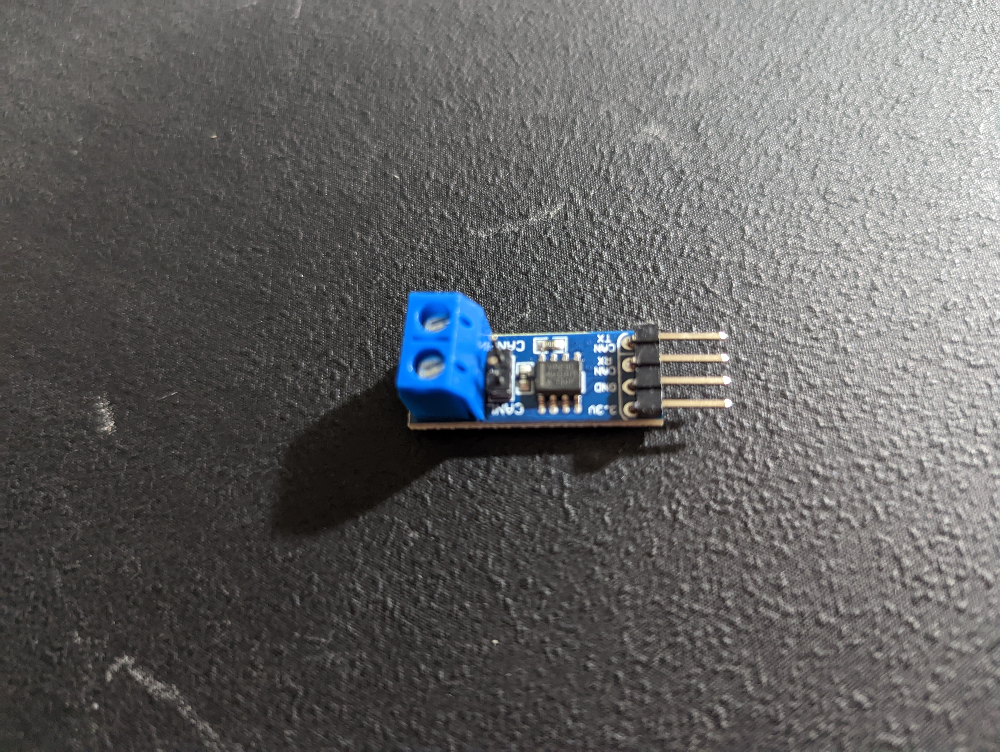
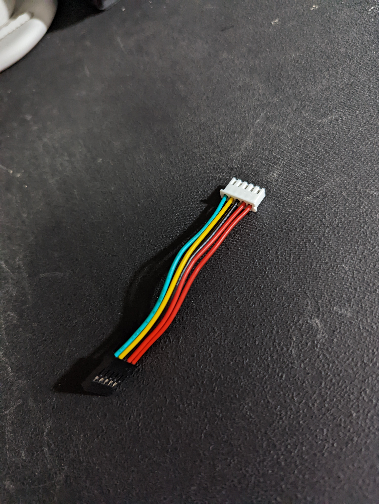
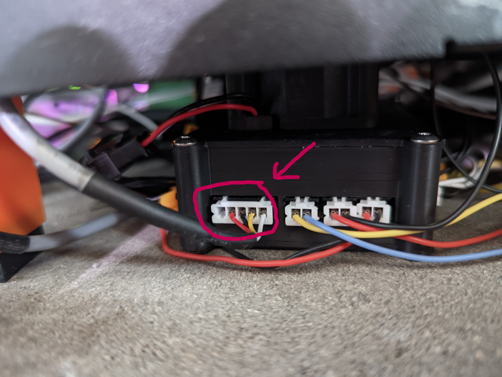
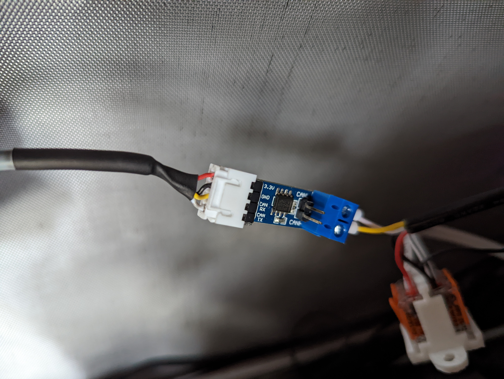
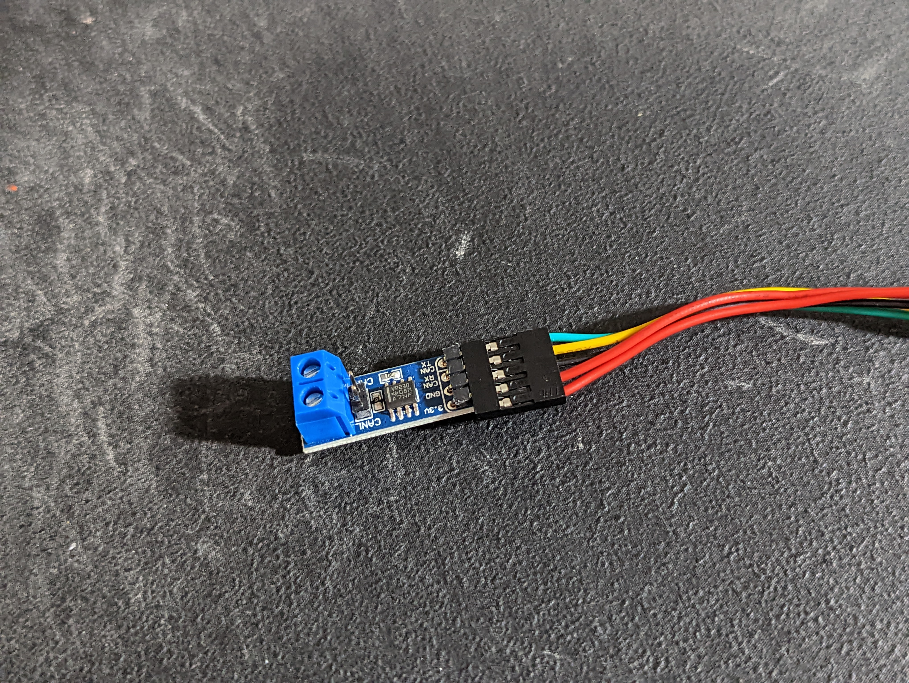
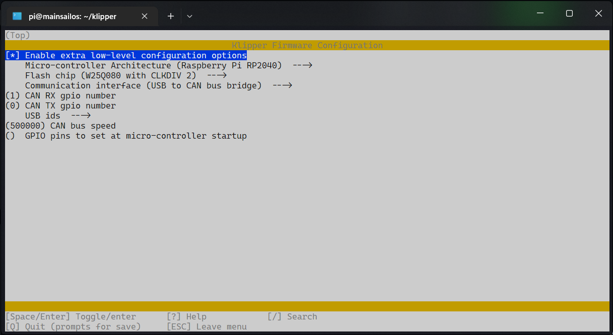
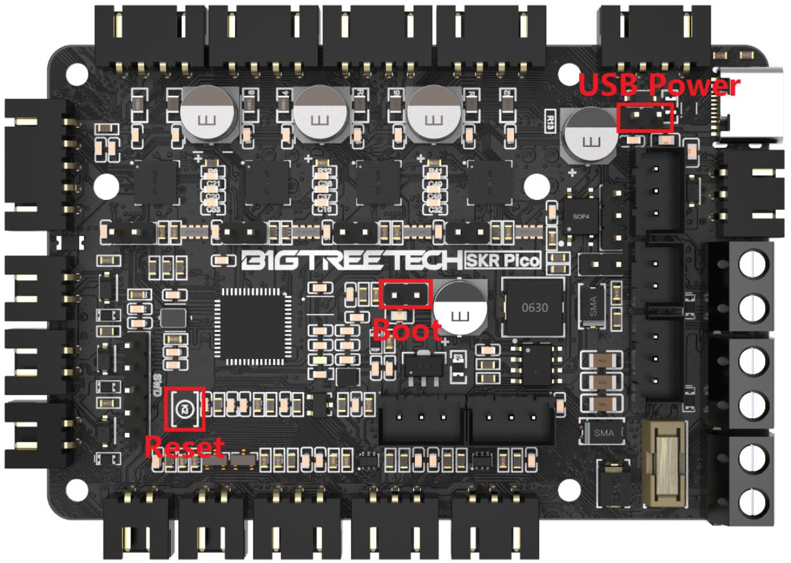

<!--
 Copyright (c) 2022 Chris Laprade (chris@rootiest.com)
 
 This software is released under the MIT License.
 https://opensource.org/licenses/MIT
-->

# CANbus your Pico

This guide describes how to use an SKR-Pico (or any Pico board) as both a CANbus bridge *and* a Klipper mcu.

## Why use CANbus?

### What is CANbus?

CANbus is a very efficient, low-latency protocol that is commonly used in industrial applications such as robotics, CNC, vehicles/cars, and more recently, 3D printers.

It's a way to communicate with your printer's mcu(s), much like USB and UART. Unlike typical USB connections, and especially UART connections, it can be daisy-chained. CANbus acts as a network, sort of like your LAN network.

### Why use it on your printer?

The most popular reason is to connect a toolboard.

Take a look at your current printhead. How many wires does it take to manage everything on your printhead? 

Probably quite a few.

Now think of all the optional components you *don't* have on your printhead. Perhaps things like an accelerometer, filament sensor, RGB leds, endstops for each axis, etc. Perhaps you don't even currently have a direct drive extruder but might want one in the future.

All those wires add up. You'll end up with a pretty beefy "umbilical" or a large cable chain to run all those wires from your printer's mcu.

Now think of all the ports/pins those components use on your printer board. Perhaps you've envisioned getting a second independently-driven Z-stepper but your printer board doesn't have an extra driver for that. Maybe there's other features your board is missing that you would like to have, but only large expensive boards like the Octopus provide them.

So traditionally, we are running a whole lot of wires from our printer board to the hotend just to drive everything there, and using boards that only provide connections for the minimum requirements to drive a typical cartesian printer.

Klipper supports multiple mcu's. Perhaps some of you are familiar with using a pico or your pi's gpio pins to add additional components.

But those dev boards (and the pi itself) aren't really designed for this use-case. We don't have 24V fan connectors or stepper drivers, etc.

And buying a new printer board can get expensive quickly, especially if you are shooting for the latest and greatest features.

This is why CAN is a great option. We have access to boards like the EBB that have really fantastic features on a board designed/sized to fit on the back of a stepper motor.

CAN allows us to connect that board with just 4 pins:
  1. 24V
  2. GND
  3. CAN-Data-High
  4. CAN-Data-Low

That's it. Just 4 pins. So you can use a 4-conductor cable to drive the whole thing. Including the hotend heater, stepper driver, etc. Everything through one small cable.

You can even daisy-chain them if (for example) you want to use multiple extruders. You could just get multiple CAN toolboards and connect them via a single cable.

There are also many other boards, including full-size printer boards that support CANbus communication.

## The SKR-Pico

The SKR-Pico is a great board that's less expensive than the popular SKR E3-Mini series with nearly identical features.

It's a great choice for Ender-style printers and is actually improving as the community takes advantage of the very flexible and powerful RP2040 chip.

Further, we can take advantage of this off-label feature and use it to host a CAN network as well.

As the SKR-Pico is using that RP2040 (Raspberry Pi Pico) chip, it's compatible with [the recent work from Kevin O'Connor](https://github.com/KevinOConnor/can2040) to enable CANbus bridging on those chips in Klipper. 

This allows you to assign pins to be used for CANbus communication and the rest of the board works exactly the same as before except instead of registering as a USB device, it shows up as a CAN device on the CAN network that it is hosting itself.

You do not lose any functionality of the board by doing this, only gain CANbus capability.

No CANhat or other devices required! 

It *does* require an inexpensive CAN transceiver.

An SN65HVD230 is what is recommended but theoretically any CAN transceiver chip should work.

[This is what I purchased](https://smile.amazon.com/SN65HVD230-CAN-Board-Transceiver-Microcontrollers/dp/B084M5ZQST/).

Note: The power pins on this board say 3.3V but it appears to be completely 5V tolerant. (I took the risk so you wouldn't have to!) and it works perfectly fine driven by a 5V pin on my SKR-Pico.

## How to do it

I'm going to assume you already have the SKR-Pico working and configured over USB.

If you've just purchased one, you should start with that. They have really great documentation. Make sure everything works traditionally before trying to configure CAN.

Now, we're going to use the convenient UART connector on the SKR-Pico. A short pre-made cable for this connector is even included in the box, for connecting the board to a pi over UART.

The pinout of that cable is compatible with the transceiver, so it's a great fit that means this modification can be done entirely without soldering.

The pins on the connector are: (from left to right)

1. 5V
2. 5V
3. GND
4. GPIO1
5. GPIO0

We only need the one 5V pin obviously, but that's ok.

Plug the JST connector onto the board, and the other end of the cable is a Dupont connector.

NOTE: I used a custom-made cable so mine won't look exactly the same in the photos.

Align the ***second*** 5V pin of the Dupont connector with the 3.3V pin on the transceiver and the GND should match with GND, GPIO1 goes to CANRX, GPIO0 goes to CANTX.

That's it, the transceiver is connected!

Here is what it would look like with the included cable:

        Transceiver -> Color -> SKR-Pico

        1. CAN-TX   -> Green   -> GPIO0
        2. CAN-RX   -> Yellow  -> GPIO1
        3. GND      -> Black   -> GND
        4. 3.3V     -> Red     -> 5V
        5. EMPTY    -> Red     -> 5V

You will connect the CAN signal pins to the screw terminals on the opposite end of the transceiver. 

You will connect the 24V and GND of your CANboard(s) to your PSU.

## Flashing the CANbridge firmware

We need to flash a new firmware onto the SKR-Pico that will take advantage of the CAN transceiver and allow the rest of the board to communicate over CAN.

You should be familiar with this process:

It's going to be very similar to the compiling/flashing process [described in the SKR-Pico docs](https://github.com/bigtreetech/SKR-Pico/blob/master/BTT%20SKR%20Pico%20V1.0%20Instruction%20Manual.pdf).

Run the following commands via ssh to your Klipper host:

    cd ~/klipper
    make menuconfig

This will open a screen where we can configure a Klipper firmware.

Here are the proper settings:

NOTE: In this guide we are using GPIO1/GPIO0 for CAN RX/TX but any available pin can be assigned instead. These are just the most conveniently located with a ready-made connector conveniently included.

So match those settings, and then press `q`

Press `y` to save changes.

Now run:

    make

This will take a moment, and once complete it will spit out a `klipper.u2f` file in `~/klipper/out`

Now we need to put the board into flashing mode.

This can be done with the board powered by the PSU, or you can use a jumper to power it over USB. Either way will work.

In either case we need to set the boot jumper. This can be done while the board is powered on, just slip on the jumper and press the reset button on the board.

Or, you can put the jumper on with the board powered off and you will not need to press reset, just turn the board on.

You can now try to run the following command:

    sudo mount /dev/sda1 /mnt

If putting the SKR-Pico into flash-mode was unsuccessful, it won't show up as a mountable storage device.

If you have other external storage devices the `sda1` part may be different.

You can use the following command to see all the available storage devices:

    sudo fdisk -l

Match your Pico with the correct `/dev/sda#` address and modify the `mount` command as necessary.

When you have successfully mounted the storage there will be no feedback or errors from the mount command.

You can test it by running:

    ls /mnt

The storage should contain a couple of files:

1. INDEX.HTM
2. INFO_UF2.TXT

If the `ls` command returns those, you are ready to flash!

Run the following command:

    sudo cp out/klipper.uf2 /mnt

This will copy the firmware image we compiled earlier onto the SKR-Pico's storage and it will be flashed automatically.

This take a minute or so.

When it is complete, the storage will be automatically unmounted.

I repeatedly run the `ls /mnt` command until it stops listing the files. That indicates the flash is now complete.

At this time, the printer will no longer connect to the SKR-Pico mcu with the old usb configuration.

Also, the `ls /dev/serial/by-id/*` command we traditionally use to see usb mcu's will not show the SKR-Pico either.

This tripped me up initially, I assumed the flash had failed.

In reality, the board is no longer registering as a usb serial device, it is registering as a usb CAN bridge. The SKR-Pico board will respond as a CAN device.

At this point I recommend rebooting the host/pi. I don't know that it's necessary, but that's what I did.

Once it comes back up, make sure the SKR-Pico is powered on and  run the following command:

    sudo ip link set up can0 type can bitrate 500000

This will bring up the CAN network.

Then run:

    ~/klippy-env/bin/python ~/klipper/scripts/canbus_query.py can0

This command will list all the detected CAN devices on that CAN network. You should see the id for the SKR-Pico.

Write down/copy that id, we will need it in our `printer.cfg` file.

In that file, you will need to change:

    [mcu]
    serial: /dev/serial/by-id/usb-Klipper_rp2040_45503571270BCFD8-if00

to:

    [mcu]
    canbus_uuid: 41674b3a9356 

NOTE: Both your id's will be different than those shown above, they are unique to your board. I just used mine as an example.

So we are telling Klipper to connect to the SKR-Pico via CANbus using that uuid we found earlier instead of using USB and a usb-id.

Save the changes and at this point you should be able to boot your printer with this configuration.

I found that I had trouble sometimes bringing the CAN network back up after a `FIRMWARE_RESTART`

This can be solved by the following process.

Run:

    sudo nano /etc/network/interfaces.d/can0

Change the first line:

    auto can0

to:

    allow-hotplug can0

Press `Ctrl+X` to exit the editor, followed by `Y` and `Enter` to save changes. Then reboot again to be sure.

After making this change I had no issues starting the printer no matter how it was shut down.

## Congrats! 

You now have a CANbus network and your first CANbus device!

You could stop here and everything will work just fine.

But you probably did this because you want to:

## Connect additional CAN boards.

We've now installed the necessary hardware and flashed the firmware so we have a working CANbus network.

So all you need to do is connect a CANbus board which is flashed with CANbus Klipper firmware to the CAN transceiver.

I use [a BigTreeTech EBB](https://github.com/bigtreetech/EBB) which has great documentation for how to configure it for this purpose as well as pre-made firmware images for CANbus mode. 

You will need to configure and flash your boards as required/documented by the manufacturer. 

This process varies greatly between boards/chips so I'm not going to go into detail and assume you have done so successfully.

At this point you can (with the power off) connect that board's CAN port as follows:

1. 24V -> your PSU
2. GND -> your PSU
3. CANL -> CANL on the transceiver
4. CANH -> CANH on the transceiver

Boot back up and power everything on. 

Run this command again:

    ~/klippy-env/bin/python ~/klipper/scripts/canbus_query.py can0

You should see two uuid's listed.

The SKR-Pico's id which we already configured, and an additional one. This additional uuid belongs to your addon board.

You can configure it the same as we did the main printer board. For my EBB it looks like this:

    [mcu EBBCan]
    canbus_uuid: e8d3e3388393

Update your config with that canbus id and you should be good to go.

If you have not set up the entire toolboard config yet you can juse just that `[mcu]` section to test, with no other components. 

It should still boot though none of its components/features will function without their associated configs.

However, that's an easy way to ensure the CANbus communication is working correctly.

You can then add all the rest of the config for that board as you would normally.

That's it! These steps can be repeated for additional CAN boards, and you can daisy-chain as many as you like.

## Extras

So now you have an SKR-Pico working properly and a toolhead board that's driving all the components on the toolhead.

This frees up some ports on the SKR-Pico we can use for other purposes.

Since we are using the stepper driver on the toolboard for the extruder, we now have an extra stepper driver available on the Pico that we can use to drive a second z-stepper.

Just use the pins assigned to the extruder on the pico instead for stepper_z1:

In my case that meant changing:

    [extruder]
    step_pin: gpio14
    dir_pin: !gpio13
    enable_pin: !gpio15
    microsteps: 16
    rotation_distance: 33.500
    nozzle_diameter: 0.4
    filament_diameter: 1.75
    heater_pin: gpio23
    sensor_type: EPCOS 100K B57560G104F
    sensor_pin: gpio27
    control: pid
    pid_Kp: 22.2
    pid_Ki: 1.08
    pid_Kd: 114
    min_temp: 0
    max_temp: 300
    max_extrude_cross_section:2

    [tmc2209 extruder]
    uart_pin: gpio9
    tx_pin: gpio8
    uart_address: 3
    run_current: 0.650
    hold_current: 0.500
    stealthchop_threshold: 999999

to:

    [stepper_z1]
    step_pin: gpio14
    dir_pin: gpio13
    enable_pin: !gpio15
    microsteps: 16
    rotation_distance: 8
    # endstop_pin: ^gpio25
    # position_endstop: 0
    endstop_pin: probe:z_virtual_endstop

    [tmc2209 stepper_z1]
    uart_pin: gpio9
    tx_pin: gpio8
    uart_address: 3
    run_current: 0.580
    hold_current: 0.500
    stealthchop_threshold: 999999

NOTE: We are just copying the pins from the `[extruder]` config to a `[stepper_z1]` config and removing the extruder-specific lines.

I also matched the `current` values to what I used on my `[stepper_z]` config section.

We also have 3 PWM fan pins available now which can be used for things like a system/mcu fan, an exhaust fan, bed fans (for heated chamber), etc.

We also have a thermistor connector which can be used with a cheap, readily-available thermistor to measure temperature elsewhere on the printer. I used my old stock Ender thermistor and stuck it on one of my stepper motors to monitor the stepper temperature. 

Here is my config for that:

    [temperature_sensor steppers]
    sensor_type: EPCOS 100K B57560G104F
    sensor_pin: gpio27

You can use it for whatever you like though, consider it a free temperature sensor!

We also have the filament sensor and probe connectors free. Those can be used to drive other components like buttons or a rotary encoder, etc.

We also have the hotend heater connector. I'm not sure what that could be used for, but it's available now nonetheless.

## Conclusions

I hope this guide will help anyone who is considering (or in the process of) using CANbus to expand their printer's capability/simplify its wiring.

I highly recommend the SKR-Pico as it's an inexpensive and feature-rich board that is perfect for this kind of modification on a typical Ender-style printer.

If you were thinking on purchasing an SKR Mini E3 board and also a CANbus toolhead, I encourage you to consider an SKR-Pico instead as it will be a better fit for a CANbus printer.

I also want to point out that if you don't want an SKR-Pico, that's totally ok as well!

The same procedure can be performed with a basic Raspberry Pi Pico board. The steps are more or less identical.

Then that Pico board will host your CAN network instead of an SKR-Pico. It can also still be added to Klipper as a CAN device and its pins utilized within Klipper just like without CAN.

If you like your printer mcu and don't want to replace it but already have a Pico (perhaps to host an ADXL) then you can use that Pico with a transceiver to host the CAN network and connect any CANbus boards.

The only caveat is you may need to use different pins for CANRX/CANTX.

And you will need to ensure its ground is tied to the PSU that is powering your other CAN boards.

You can simply run a wire from one of the GND pins on your Pico to a ground terminal on your PSU. It's completely fine that they are a different voltage as long as you only connect ground.

This isn't necessary when using the SKR-Pico because both it and any toolhead boards are powered by the same PSU and their grounds are already tied together by that fact.